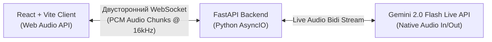

# Level 1: Voice-Only MVP (One Screen, One Feature)

## 1. Functional Specification
# Функциональная спецификация MVP: FluentlyAI (One Screen, One Feature)

## 1. Суть проекта
Веб-страница с **одной единственной функцией**: голосовой звонок с AI-репетитором по английскому языку в реальном времени.

Никаких переходов по страницам, никаких настроек, никаких меню.

---

## 2. Единственный экран приложения

На экране находится всего **один центральный элемент**:

### Состояние 1: До звонка (Вход)
* По центру экрана — большая кнопка **«Позвонить репетитору»** (или иконка телефонной трубки / микрофона).
* Короткий текст сверху: *«Разговорный английский с AI»*.

---

### Состояние 2: Во время звонка (Активный разговор)
Пользователь нажимает на кнопку — звонок начинается:
1. **Индикатор голоса (в центре):**
   * Визуальный круг / волна, которая пульсирует, когда говорит пользователь, и когда говорит репетитор.
2. **Живой разговор:**
   * Репетитор голосом здоровается на английском и задает простой вопрос.
   * Пользователь говорит в микрофон — репетитор сразу отвечает голосом на английском и поддерживает беседу.
   * **Перебивание репетитора (Click-to-Interrupt в MVP):** Если пользователь хочет перебить говорящего репетитора — он нажимает на центральную звуковую сферу/индикатор. Репетитор мгновенно замолкает, очищает аудио-буфер и переходит в режим прослушивания (сделано кликом для исключения случайных ложных срабатываний микрофона от динамиков).
3. **Кнопка завершения:**
   * Та же центральная кнопка становится красной с надписью **«Завершить звонок»**.

---

### Состояние 3: Завершение звонка
* Пользователь нажимает «Завершить звонок».
* Звонок мгновенно отключается, кнопка снова становится зеленой **«Позвонить репетитору»**.

---

## 3. Что полностью отсутствует в этом MVP
* ❌ Нет регистрации и авторизации.
* ❌ Нет выбора уровней, тем и аватаров.
* ❌ Нет видео, камеры и 3D-графики.
* ❌ Нет отчетов после звонка и оценок.
* ❌ Нет базы данных и истории звонков.

---

## 4. Главный критерий готовности
* Открыл сайт с телефона или ноутбука ➔ нажал кнопку ➔ говоришь на английском с AI голосом без задержек.

---

## 2. Technical Specification
# MVP Technical Specification: FluentlyAI (Voice-Only MVP)

## 1. Архитектура MVP

Архитектура сведена к абсолютному минимуму: **Клиент (SPA)** напрямую соединяется по **WebSockets** с легковесным **Python FastAPI** сервером, который стримит аудио в реальном времени.



---

## 2. Стек технологий MVP

| Слой | Технология | Зачем |
| :--- | :--- | :--- |
| **Frontend** | **React + Vite + TypeScript + Tailwind CSS** | 1 экран, сборка за секунды, легкий бандл (<100 КБ). |
| **Аудио на клиенте** | **Web Audio API (`AudioContext` + `ScriptProcessorNode` / `AudioWorklet`)** | Захват звука с микрофона (16-bit PCM 16kHz) и воспроизведение входящего аудио-потока. |
| **Backend** | **Python 3.12 + FastAPI + `uvicorn`** | Асинхронный WebSocket-сервер для проксирования и оркестрации аудио-потоков. |
| **AI Voice Engine** | **Gemini 2.0 Flash Live API (Bidi WebSocket)** *(или Deepgram + Gemini + Cartesia)* | Нативный вход и выход аудио (Audio-in ➔ Audio-out) в одном постоянном сокете с задержкой **<500 мс** и встроенным определением пауз и перебиваний. |
| **Деплой фронтенда** | **Vercel / Cloudflare Pages** | Бесплатный хостинг статики, мгновенная сборка, SSL-сертификат из коробки. |
| **Деплой бэкенда** | **Render.com (Web Service)** | Нативный Python 3.12 рантайм, полная поддержка WebSockets, автоматический бесплатный SSL (`wss://`), автодеплой из GitHub. |

---

## 3. Структура проекта

```
fluently-mvp/
├── frontend/                     # React + Vite клиент
│   ├── src/
│   │   ├── components/
│   │   │   └── VoiceVisualizer.tsx  # Пульсирующая сфера звука (Canvas)
│   │   ├── hooks/
│   │   │   └── useVoiceCall.ts      # Хук управления микрофоном и WebSocket
│   │   ├── App.tsx                  # Единственный экран приложения
│   │   └── main.tsx
│   ├── package.json
│   └── vite.config.ts
│
├── backend/                      # Python FastAPI бэкенд
│   ├── app/
│   │   ├── main.py                  # Точка входа, FastAPI + WebSocket эндпоинт
│   │   ├── config.py                # Загрузка API-ключей (.env)
│   │   └── gemini_live.py           # Двусторонний аудио-клиент к Gemini Live API
│   ├── requirements.txt             # fastapi, uvicorn, websockets, python-dotenv
│   └── Dockerfile                   # Для деплоя на Railway / Render
└── README.md
```

---

## 4. Спецификация взаимодействия (WebSocket Protocol)

### Подключение:
Клиент подключается к `wss://api.yourdomain.com/ws/call`

### Формат данных:
* **От клиента к серверу (`Client -> Server`):**
  * Бинарные сообщения: чанки сырого аудио **Linear PCM (16 kHz, 1 channel, 16-bit)** каждые 100 мс.
  * Текстовые сообщения (команды):
    * `{"type": "start_call"}`
    * `{"type": "stop_call"}`

* **От сервера к клиенту (`Server -> Client`):**
  * Бинарные сообщения: чанки сгенерированного голоса репетитора (PCM 24 kHz) для мгновенного воспроизведения через Web Audio API.
  * Текстовые сообщения (статусы):
    * `{"type": "status", "state": "listening" | "speaking"}`
    * `{"type": "interrupted"}` (команда клиенту очистить текущий аудио-буфер).

---

## 5. Системный промпт тьютора (System Instruction)

```text
You are Alex, an enthusiastic and friendly English language tutor having a casual live voice call with a student.
- Keep your answers short (1-2 sentences maximum).
- Speak naturally and warmly.
- Always ask a simple follow-up question to encourage the user to speak.
- Greet the user warmly when the call starts.
```

---

## 6. План деплоя в онлайн (Production Deployment)

### 1. Деплой Бэкенда на Render.com:
1. Создать новый **Web Service** в дашборде [dashboard.render.com](https://dashboard.render.com).
2. Подключить свой GitHub репозиторий (папку `backend`).
3. Параметры сервиса:
   * **Runtime:** `Python 3`
   * **Build Command:** `pip install -r requirements.txt`
   * **Start Command:** `uvicorn app.main:app --host 0.0.0.0 --port $PORT`
4. В разделе **Environment Variables** добавить:
   * `GEMINI_API_KEY` = `ваш_ключ_от_Google_AI_Studio`
5. Render сгенерирует публичный URL: `https://fluently-backend.onrender.com` (WebSocket эндпоинт: `wss://fluently-backend.onrender.com/ws/call`).

### 2. Деплой Фронтенда на Vercel:
1. В дашборде Vercel импортировать папку `frontend`.
2. Добавить переменную окружения:
   * `VITE_WS_URL` = `wss://fluently-backend.onrender.com/ws/call`
3. Нажать **Deploy** ➔ Готовое приложение доступно по ссылке `https://fluently-app.vercel.app`.
