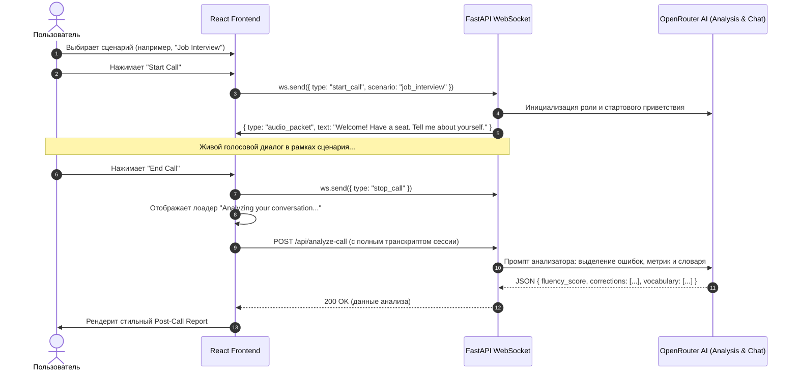

# Спецификация Уровня 2: Scenarios Hub & Post-Call AI Analytics

> **Цель Уровня 2:** Превратить базовый голосовой звонок в полноценный тренажер разговорного английского: добавить выбор жизненных ролевых сценариев перед звонком и глубокий AI-разбор ошибок и словарного запаса после звонка (в строгом соответствии с `master_functional.md` разд. 3.2 и 4.3).

---

## 1. Функциональные требования Уровня 2

### 1.1. Выбор сценариев перед звонком (Scenarios Hub)
На главной странице перед началом звонка пользователь выбирает режим разговора:
1. ☕️ **Casual Chat (Свободная беседа):**
   * *Роль Алекса:* Харизматичный, остроумный американский друг.
   * *Цель:* Раскрепоститься, легко поболтать о жизни, музыке, планах и хобби.
2. ✈️ **Airport & Travel (Аэропорт и путешествия):**
   * *Роль Алекса:* Сотрудник паспортного контроля / авиакомпании в JFK Airport.
   * *Цель:* Ответить на вопросы о цели визита, багаже, билетах и отеле.
3. 💼 **Job Interview (Собеседование на работу):**
   * *Роль Алекса:* Tech / HR Recruiter международной компании.
   * *Цель:* Рассказать о своем опыте, сильных сторонах и ответить на классические вопросы ("Tell me about yourself", "How do you handle deadlines?").
4. 🍕 **Restaurant & Cafe (Ресторан и заказ еды):**
   * *Роль Алекса:* Официант популярного бруклинского кафе.
   * *Цель:* Сделать заказ, попросить заменить ингредиент, спросить счет.

---

### 1.2. Экран отчета и AI-аналитики после звонка (Post-Call Analytics)
После нажатия кнопки «Завершить звонок» автоматически открывается красивый модальный экран итогов:
1. **Ключевые метрики сессии:**
   * ⏱ Длительность звонка (мин : сек).
   * 🗣 Talk-time Ratio: соотношение реплик пользователя и тьютора.
   * 🏆 Общая оценка беглости (Fluency Score: 1-100%).
2. **Разбор грамматики и выражений (Grammar & Natural Phrasing):**
   * Список неточностей с разбором:
     * ❌ *Как сказал пользователь:* (например, "I go to store yesterday")
     * ✅ *Как сказать натуральнее:* ("I went to the store yesterday")
     * 💡 *Почему / Правило:* (Past Simple для завершенных действий в прошлом)
3. **Словарик сессии (Vocabulary Bank):**
   * 3–5 продвинутых и полезных слов/идиом, которые прозвучали в разговоре, с переводом на русский и примером контекста.
4. **Полный транскрипт (Full Transcript):**
   * Список всех реплик диалога со временем и разделением по спикерам.
5. **Действия:**
   * Кнопка «Попробовать снова» (Practice Again).
   * Кнопка «К выбору сценариев» (Back to Hub).

---

## 2. Архитектура и Data Flow



---

## 3. Схема данных (API & Schemas)

### 3.1. POST `/api/analyze-call`
* **Request Payload:**
```json
{
  "scenario_id": "job_interview",
  "transcripts": [
    { "speaker": "tutor", "text": "Tell me about your background." },
    { "speaker": "user", "text": "I working in software since 3 years." }
  ],
  "duration_seconds": 120
}
```

* **Response Payload:**
```json
{
  "fluency_score": 85,
  "summary": "Great confidence! You answered all questions directly and maintained a solid flow.",
  "talk_time_percentage": 58,
  "user_phrases_count": 8,
  "corrections": [
    {
      "original": "I working in software since 3 years",
      "improved": "I have been working in software for 3 years",
      "explanation": "Use Present Perfect Continuous ('have been working') and 'for' with time duration."
    }
  ],
  "vocabulary": [
    {
      "word": "deadline-driven",
      "translation": "ориентированный на соблюдение дедлайнов",
      "example": "I thrive in deadline-driven environments."
    }
  ]
}
```
