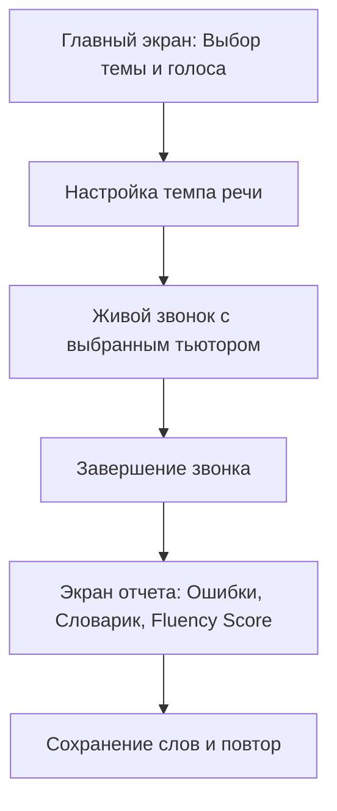

> ⚠️ **OUTDATED (2026-08-28).** Историческая версия, не используется. Актуальная мастер-спека: `master_functional.md` (v1). Таски по этому файлу не генерировать.

# Мастер-спецификация: FluentlyAI (Функциональная архитектура)

> **Миссия продукта:** Полноценный персонализированный AI-репетитор английского языка, который заменяет дорогостоящие занятия с живым носителем (iTalki, Skyeng, Cambly) за счет ультра-реалистичного голосового общения, видео-интерактивности и мгновенной аналитики речи.

---

## 1. Концепция и ключевая ценность
* **Real-time Voice Conversation:** Живой разговор с минимальной задержкой (<500–800мс), перебиванием в реальном времени и натуральной речью.
* **Grounded Natural Charisma (Без кринжа и угодничества):** Тьютор говорит как взрослый, уверенный, спокойный носитель языка (настоящий американский/британский друг или профессионал), без фальшивого передоза восторгов и неестественного подобострастия.
* **Smart Context Structuring & Memory:** Структурированный контекст диалога (Anchor + Sliding Window + Memory), удерживающий нить беседы на любой длине звонка без потери контекста и без зацикливаний.
* **Multi-Voice & Accent Engine:** Поддержка нескольких высококачественных нейронных голосов (American Male/Female, British Male/Female) с настройкой темпа речи.
* **Interactive Scenario Hub:** Ролевые сценарии из реальной жизни (Casual, Airport, Job Interview, Cafe).
* **Post-Call AI Feedback & Analytics:** Глубокий разбор грамматических ошибок, оценка беглости (Fluency Score) и персональный словарный банк после каждого звонка.

---

## 2. Профиль личности и речевой стиль (Tutor Personality Matrix)

### 2.1. Естественная харизма (Grounded Conversational Tone)
* **Запрещен фальшивый восторг (Anti-People-Pleasing):** Тьютор не кричит «Oh wow! That is the most amazing thing ever!».
* **Уверенный, спокойный, зрелый стиль:** Реалистичные короткие реакции («Gotcha», «Makes sense», «Fair point», «That sounds solid»).
* **Уместный юмор и легкая ирония:** Тьютор может пошутить или задать неожиданный вопрос, но без циркачества.
* **Лаконичность (Brevity):** Реплики строго 1–2 предложения (до 15–20 слов), давая пользователю говорить 70%+ времени.

---

## 3. Модуль голосов и звучания (Voice & Audio Engine)

### 3.1. Выбор нейронных голосов (Voice Selector)
1. 🇺🇸 **Guy (American Male):** Уверенный, спокойный, натуральный баритон (`en-US-GuyNeural`).
2. 🇺🇸 **Jenny (American Female):** Теплый, дружелюбный американский голос (`en-US-JennyNeural`).
3. 🇬🇧 **Ryan (British Male):** Классический британский мужской акцент (`en-GB-RyanNeural`).
4. 🇬🇧 **Sonia (British Female):** Элегантный, чистый британский женский голос (`en-GB-SoniaNeural`).

### 3.2. Настройка темпа речи (Speech Rate)
* **0.9x (Relaxed):** Для начинающих (A1–A2) — четкая артикуляция и умеренный темп.
* **1.0x (Natural):** Стандартный разговорный темп нейтива.
* **1.1x (Fluent):** Быстрый темп для тренировки восприятия беглой речи (B2–C1).

---

## 4. Память и стабильность контекста (Context & Anti-Loop Safeguards)

1. **Scenario Anchor:** Первое системное сообщение всегда жестко закрепляет роль, цель и контекст сценария.
2. **Context Hygiene (Sliding Window):** Очистка дубликатов и срез последних реплик без перегрузки контекста токенами.
3. **Anti-Repetition Guard:** Автоматическая детекция и подавление повторов одинаковых фраз тьютора.
4. **Dynamic Fallback Rotation:** При временной недоступности LLM используется пул разнообразных контекстных фраз поддержки вместо одного зацикленного сообщения.

---

## 5. Пользовательский путь (User Journey)

---

## 6. Каталог сценариев (Scenarios Hub)
1. ☕️ **Casual Talk:** Повседневный разговор о хобби, планах, фильмах и жизни.
2. ✈️ **Airport & Customs:** Прохождение границы и таможни в JFK Airport.
3. 💼 **Job Interview:** Собеседование на работу в международную компанию.
4. 🍕 **Cafe & Dining:** Заказ еды, напитков и общение с официантом.
